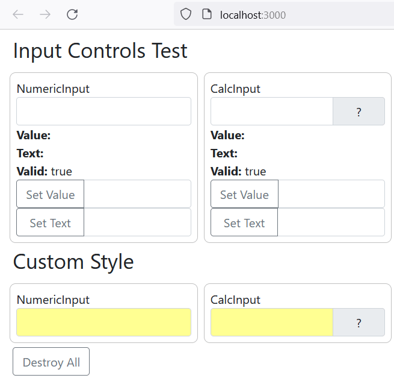
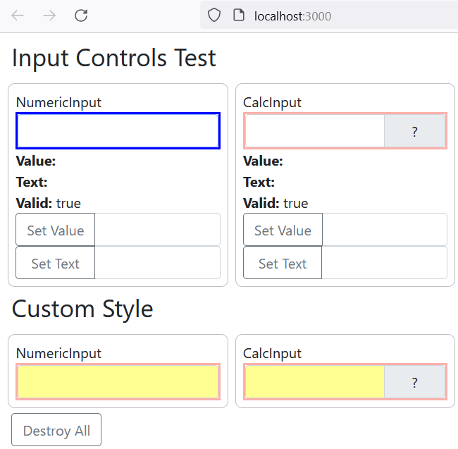
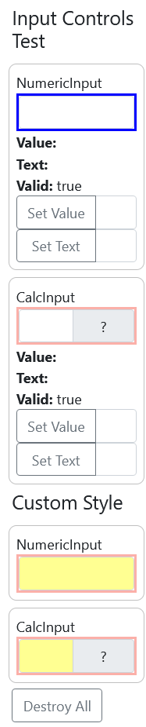
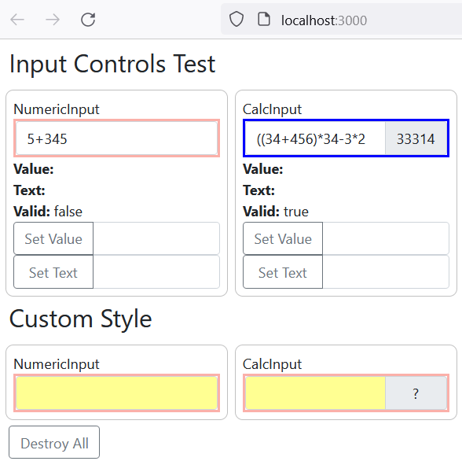
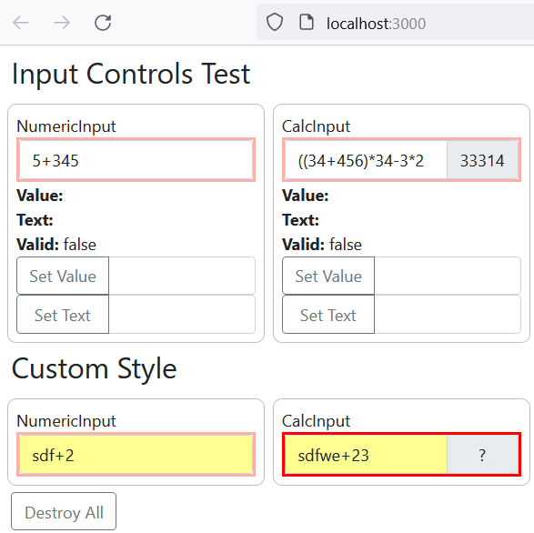
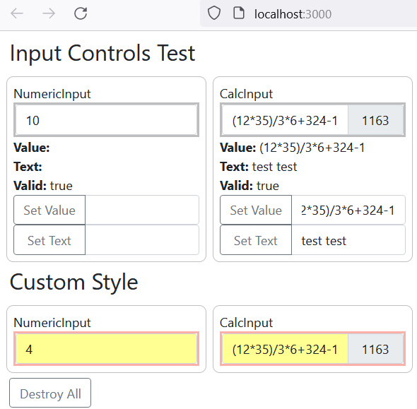

# basic-stateful-input-controls-typescript

Stateful web controls via Typescript. Less code written as much as possible.

Features:
1. Border colors of input elements change after focusing the input element.
2. Auto calculation occurs while tapping into input elements.
3. Calculation result appears in the input elements.
4. *, /, +, - calculations should be calculated inside written expression.
5. Border colors imply that written expression is correct or not.
6. `?` appears when the expression is incorrect.
7. `Destroy everything` button erases all variables, props, states, etc.
8. Responsive Design
9. Prettier configured. (Please write `npx prettier --write .` to the console :))

After executing `npm start`, below screen appears:

Focusing `NumericInput`:

Responsive display on mobile phone:

Correct expression written into CalcInput:

False expressions written into NumericInput and CalcInput:

False expressions written into Custom Syle:

## Available Scripts

In the project directory, you can run:

### `npm install`

Installs the apps packages and any packages that it depends on.

### `npm start`

Runs the app in the development mode.\
Open [http://localhost:3000](http://localhost:3000) to view it in your browser.

The page will reload when you make changes.\
You may also see any lint errors in the console.

### `npx prettier --write .`

Beautifies the entire project.